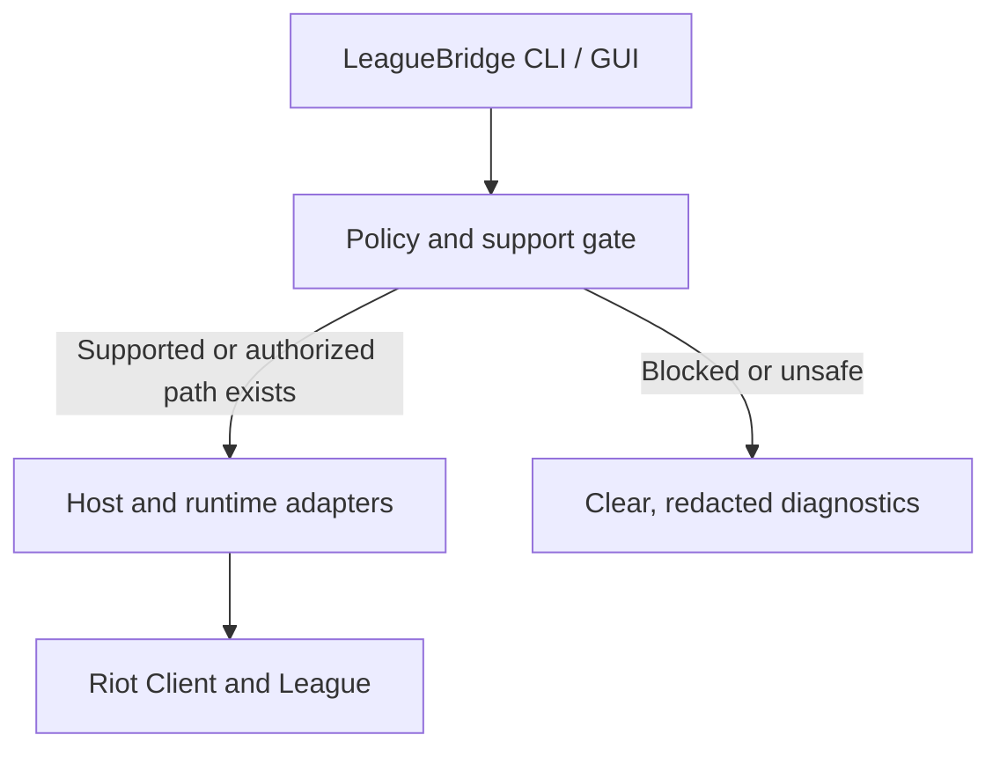

# LeagueBridge

**An open, auditable compatibility project working toward reliable, feature-complete League of Legends gameplay on Linux and BSD—without cheats, client tampering, or anti-cheat bypasses.**

> [!IMPORTANT]
> **LeagueBridge is currently a research-stage project. It does not yet make League of Legends playable on Linux or BSD.** Do not describe, package, or advertise the current repository as a working launcher.

As of **25 August 2026**, Riot Games does not officially support League of Legends on Linux and does not list any BSD operating system as supported. Riot has also stated that the former Wine/Lutris path cannot satisfy Riot Vanguard's driver requirements. Local Linux and BSD gameplay therefore remains blocked unless Riot supplies or approves a compatible anti-cheat and client path.

## Mission

LeagueBridge's long-term goal is a safe, one-click local experience that can install, update, repair, launch, and remove League of Legends on supported Linux and BSD systems with the reliability expected from an official client.

That goal is an **acceptance target**, not a present-day compatibility claim. LeagueBridge will only mark a platform as supported after the complete release criteria below pass. A live-service game can never honestly be guaranteed to have literally zero bugs forever.

The project exists to build the portable tooling, diagnostics, test coverage, packaging, and upstream relationships needed for a legitimate solution—so the community is ready if Riot provides a compatible route.

## Current status

| Platform | Long-term target | Current state | Primary blocker |
| --- | --- | --- | --- |
| Linux x86-64 (glibc) | First-class local user experience | **Blocked / research** | No official Linux client; the Wine path cannot meet Vanguard requirements |
| Linux x86-64 (musl) | First-class local user experience | **Blocked / research** | Same blocker, plus runtime and packaging differences |
| FreeBSD amd64 | First-class BSD experience | **Blocked / research** | No official client or compatible Vanguard path |
| OpenBSD amd64 | First-class BSD experience | **Blocked / research** | No official client or compatible Vanguard path |
| NetBSD amd64 | First-class BSD experience | **Blocked / research** | No official client or compatible Vanguard path |
| DragonFly BSD x86-64 | First-class BSD experience | **Blocked / research** | No official client or compatible Vanguard path |

**Targeted** does not mean **supported**. There are no supported LeagueBridge platforms or releases yet.

The initial support contract is x86-64/amd64: glibc and musl Linux across representative Debian/Ubuntu, Fedora/RHEL, Arch, openSUSE, and Alpine systems, followed by FreeBSD, OpenBSD, NetBSD, and DragonFly BSD. A derivative distribution is supported only after its own tests pass. ARM and other CPU architectures remain future research targets unless Riot publishes a compatible client for them.

## Project principles

- **Anti-cheat compliance:** never disable, bypass, spoof, emulate, hide from, or interfere with Riot Vanguard.
- **Honest status:** publish reproducible evidence and fail clearly when the game cannot run safely.
- **Upstream first:** prefer cooperation with Riot, Wine, graphics-driver, desktop, and BSD communities over permanent private patches.
- **Portable design:** keep core behavior distribution-agnostic and isolate OS-specific adapters.
- **Secure defaults:** use least privilege, verify downloaded artifacts, redact diagnostics, and never collect Riot credentials.
- **Reproducible results:** every compatibility claim must identify the OS, kernel, graphics stack, client patch, and test procedure.
- **No proprietary redistribution:** users obtain Riot software directly from Riot; LeagueBridge ships only its own open-source code and metadata.

## Definition of feature-complete

LeagueBridge will not call a platform stable until all applicable gates pass:

- [ ] Riot's client and anti-cheat operate through an authorized, non-bypass path.
- [ ] Install, update, repair, launch, and uninstall workflows are reliable.
- [ ] Sign-in, MFA, patching, champion select, and reconnect work correctly.
- [ ] Practice Tool, custom games, all currently available queues and rotating modes, matchmaking, spectating, and replays pass validation in tested regions and locales.
- [ ] Keyboard, mouse, audio, networking, windowing, and multiple-monitor behavior are correct.
- [ ] AMD, Intel, and NVIDIA graphics receive documented test coverage where the OS supports them.
- [ ] Linux Wayland and X11 sessions receive documented test coverage.
- [ ] Supported BSD desktop and graphics stacks receive documented test coverage.
- [ ] Performance, frame pacing, latency, and resource use stay within published acceptance thresholds.
- [ ] Patch-day regression tests pass before a compatibility status is promoted.
- [ ] Failures produce useful, privacy-safe diagnostics and never put an account at avoidable risk.
- [ ] Packages install and uninstall cleanly without leaving privileged services behind.

## Planned architecture

LeagueBridge is designed as an orchestration and validation layer, not a replacement game client and not an anti-cheat implementation.

Planned components:

- **Compatibility manifest** — machine-readable platform, patch, and test results.
- **Host preflight** — OS, architecture, graphics, display, storage, network, and dependency checks.
- **Policy gate** — stops unsupported or unsafe launch paths instead of attempting circumvention.
- **Lifecycle manager** — lawful installation, updating, repair, launch, and removal orchestration.
- **Runtime adapters** — small, reviewable Linux- and BSD-specific integrations.
- **Test harness** — repeatable smoke, patch, graphics, input, network, and performance tests.
- **Diagnostics** — opt-in support bundles with tokens, usernames, paths, and other sensitive data redacted.

## Scope

### In scope

- Compatibility research based on public sources and lawful interfaces
- Host readiness checks and privacy-safe diagnostics
- Reproducible installation and packaging
- Client lifecycle and desktop integration
- Graphics, audio, input, networking, and performance validation
- Automated compatibility tracking across League patches
- Coordination with relevant upstream projects and Riot, where possible

### Explicitly out of scope

- Vanguard bypasses, emulation, spoofing, concealment, disabling, or tampering
- Cheat development, bots, scripting, automation, or gameplay modification
- Patching or injecting into Riot executables, drivers, or services
- Reverse engineering, decompiling, or inspecting proprietary Riot protocols without Riot's express written authorization
- Hiding virtual machines or altering device/boot identity to evade checks
- Redistributing Riot binaries, game assets, credentials, tokens, or copyrighted content
- Private-server implementation or protocol abuse
- Claims that experimental results are safe for valuable accounts

Contributions that cross these boundaries will not be accepted.

## Roadmap

| Phase | Deliverable | State |
| --- | --- | --- |
| 0 | Governance, scope, threat model, compatibility schema, and research log | **In progress** |
| 1 | Read-only host diagnostics and redacted support bundles | Planned |
| 2 | Documented, Riot-supported or expressly authorized client and anti-cheat path | **Blocked on upstream support** |
| 3 | Linux technical preview and cross-distribution packaging | Blocked by Phase 2 |
| 4 | FreeBSD preview, followed by OpenBSD, NetBSD, and DragonFly BSD validation | Blocked by Phase 2 |
| 5 | Patch-resilient beta with hardware and OS test matrix | Blocked by earlier phases |
| 6 | Stable 1.0 after every release gate passes | Long-term target |

There is intentionally no release date for local gameplay. The decisive dependency is outside this repository, and pretending otherwise would mislead users.

## Installation

There is nothing to install yet. LeagueBridge has not published a playable build.

Until the status changes, use an operating system and configuration supported by Riot Games. Be cautious of third-party downloads claiming to make Vanguard work on Linux or BSD, especially those asking you to disable security features, patch the client, hide a virtual machine, or run opaque code as root.

## Contributing

Contributions are welcome, particularly in these areas:

- Compatibility research based on public sources and clear citations
- Linux and BSD platform-detection design
- Reproducible test plans and compatibility-data schemas
- Safe logging and automatic secret redaction
- Packaging architecture and desktop integration
- Documentation, accessibility, localization, and CI design

Before proposing gameplay-enabling code, explain the authorized anti-cheat path it uses and provide a reproducible threat and safety analysis. Open an issue before starting a large change so the approach can be reviewed early.

By contributing, you agree that your contribution may be distributed under the project's `0BSD` license.

Bug reports should include only non-sensitive system details. Never post Riot passwords, session tokens, authentication cookies, full unredacted logs, or personal information.

## Security and responsible research

LeagueBridge is a compatibility project, not a security-research publishing venue for anti-cheat weaknesses. Do not publicly disclose a technique that could enable cheating, evade Vanguard, compromise accounts, or harm Riot services.

Report vulnerabilities in Riot software through [Riot's security reporting process](https://www.riotgames.com/en/reporting-a-security-vulnerability). For vulnerabilities in LeagueBridge itself, use GitHub private vulnerability reporting when available. If it is unavailable, open a public issue that asks the maintainers to establish a private channel, but include no vulnerability details.

## Frequently asked questions

### Can LeagueBridge run League on Linux or BSD today?

No. The repository is currently in research/pre-alpha status and has no playable release.

### Why not just use Wine or Proton?

The main blocker is not ordinary Windows API or graphics translation. Riot states that the Wine/Lutris implementation cannot satisfy Vanguard's driver requirements. LeagueBridge will not work around that restriction by weakening or deceiving anti-cheat checks.

### Will LeagueBridge bypass Vanguard?

No. Anti-cheat bypasses are permanently out of scope. A legitimate gameplay release requires a path that Riot supports or explicitly permits.

### Will a Windows virtual machine be supported as a workaround?

No. Riot states that Vanguard is not supported in virtual-machine environments, and LeagueBridge will not hide virtualization from it.

### Does Vanguard On-Demand remove the blocker?

No. Riot's optional On-Demand mode still depends on a secured Windows 11 25H2 environment and Windows security features. It does not provide a Linux or BSD runtime.

### What does “100% compatibility” mean here?

It means the complete, testable release criteria above must pass before a platform is labeled stable. It does not mean the project can promise that a changing online service will never have a bug or outage.

### Why build the project before local gameplay is possible?

Diagnostics, compatibility data, packaging, automated tests, and upstream coordination can be built responsibly now. That work shortens the path to a reliable release if Riot enables a compliant Linux or BSD route later.

## Authoritative references

- [League of Legends minimum and recommended system requirements](https://support.riotgames.com/en-us/league-of-legends/performance/minimum-and-recommended-system-requirements-league-of-legends)
- [Riot Games: /dev — Vanguard x LoL](https://www.leagueoflegends.com/en-us/news/dev/dev-vanguard-x-lol/)
- [League of Legends patch 14.9 notes — Vanguard requirement](https://www.leagueoflegends.com/en-us/news/game-updates/patch-14-9-notes/)
- [Riot Games: Vanguard On-Demand](https://www.riotgames.com/en/news/vanguard-on-demand)
- [Riot Games Support: Vanguard is not supported in virtual machines](https://support.riotgames.com/riot/client/error-van-9100)
- [Riot Games Terms of Service](https://www.riotgames.com/en/terms-of-service)
- [Riot Games Legal Jibber Jabber](https://www.riotgames.com/en/legal)
- [Riot Developer Portal: General Policies](https://developer.riotgames.com/policies/general)
- [Riot Developer Portal: League of Legends policies](https://developer.riotgames.com/docs/lol)

## Legal notice

> **LeagueBridge is not endorsed by Riot Games and does not represent the views of Riot Games or anyone involved in producing or managing Riot Games properties. Riot Games and its associated properties are trademarks or registered trademarks of Riot Games, Inc.**

LeagueBridge is an independent, noncommercial community project. The project name is provisional pending any trademark or product review Riot may require. Before distributing a player-facing build, the maintainers must register and submit the product for Riot review when Riot's current policies require it, and must obtain express authorization for any runtime integration that is not already supported.

League of Legends, Riot Games, Riot Client, Riot Vanguard, and related names, logos, characters, and assets are trademarks or property of their respective owners. The LeagueBridge license covers only LeagueBridge's own source code and documentation; it grants no rights to Riot software or assets. Users are responsible for following Riot's Terms of Service and all applicable laws.

## License

LeagueBridge is released under the [Zero-Clause BSD License](LICENSE), SPDX identifier [`0BSD`](https://spdx.org/licenses/0BSD.html). You may use, copy, modify, and distribute LeagueBridge with or without fee and without an attribution requirement, subject to the license text.
