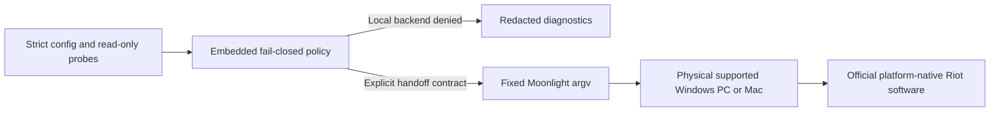

# LeagueBridge

[](LICENSE)


**An open, auditable bridge for League of Legends compatibility diagnostics and
safe access from Linux and BSD—without cheats, client tampering, VM concealment,
or anti-cheat bypasses.**

> [!IMPORTANT]
> League of Legends still does **not** run locally on Linux or BSD. Riot states
> that Wine/Lutris cannot satisfy Vanguard's driver requirements, and Riot's VAN
> 138 guidance rejects virtual machines. LeagueBridge cannot change that vendor
> gate with Proton, copied DLLs, Darling, Dockur, QEMU, or bhyve.

LeagueBridge is now a runnable alpha control plane rather than a README-only
research project. It provides fail-closed compatibility policy, read-only host
diagnostics, privacy-safe support bundles, and experimental Moonlight handoffs
to a user-owned **physical** Windows PC or Mac. League and Vanguard stay on
Windows for the Windows route; the macOS route uses Riot's native Mac
client with its Embedded Vanguard architecture and Sunshine's experimental host
support, which has no gamepad hosting.
The Linux/BSD machine is only the viewer/controller in either route.

## Current result

Reviewed **26 August 2026**; Darling, CrossOver, WinBoat, Waydroid, and
cloud-gaming routes supplemented **27 August 2026**:

| Goal | Score/state | Meaning |
| --- | --- | --- |
| LeagueBridge engineering | **74/100 after build-time repository verification** | The verified source tree has repository-backed implementation and control evidence. Ad hoc/dev builds report 0/unverified. CI execution, published-release attestations, native BSD/hardware validation, independent audit, vendor authorization, and native packages remain unverified. |
| Local League on Linux/BSD | **0/100 — blocked** | No Riot-supported client/Vanguard route exists. This is a hard gate, not a weighted score. |
| Physical Windows remote handoff | **0/100 — unvalidated** | All five Linux/BSD client platforms start at zero; no physical-host, native-client, session-quality, or gameplay-interaction gate has current content-addressed runtime evidence. |
| Physical macOS remote handoff | **0/100 — unvalidated** | Sunshine's Mac host is experimental and has no gamepad hosting; all five Linux/BSD clients start at zero and no route-bound runtime gate has authenticated evidence. |

Run `leaguebridge readiness` for the versioned scorecard and its build-time
repository-verification state. An official release build may expose the derived
74 only after verifying every referenced source file; an ad hoc/dev build
reports zero repository-backed points. This marker is not publisher signing.
Documentation or unit tests never inflate the gameplay score.

The CI workflow also runs a native Ubuntu Linux amd64 runtime smoke against the
shipped archive's install lifecycle and the CLI's read-only client preflight.
Hosted runners are intentionally headless, so that job records a blocked
Moonlight/client handoff; it does not claim that League, Vanguard, or streamed
gameplay works. BSD and hosted macOS lifecycle/runtime jobs follow the same
non-certifying boundary.

## What each attempted route actually yields

| Route | LeagueBridge decision | Technical reason |
| --- | --- | --- |
| Wine / WineHQ / Lutris | **Denied** | Riot explicitly says Wine cannot meet Vanguard's driver requirements. |
| Proton or custom Proton | **Denied** | Proton is Wine-based; Valve does not support kernel-space anti-cheat through Proton, and Riot has not opted into a Linux route. |
| CrossOver | **Denied / limited** | CodeWeavers rates the current Linux entry Limited Functionality and the Mac entry Will Not Install; it remains a Wine-based layer and cannot satisfy Vanguard. |
| Bottles, PlayOnLinux, or another Wine frontend | **Denied** | These tools manage Wine prefixes/runners; they do not add the Windows kernel driver and are covered by the same Riot restriction. |
| Extra/copy-downloaded DLLs | **Rejected** | DLLs cannot create the Windows boot/kernel trust chain and create malware, licensing, and account risk. |
| Copying/repacking Vanguard | **Rejected** | Proprietary redistribution/tampering is unsafe and still does not create an authorized host. |
| `dockur/windows` | **Denied for gameplay** | It packages QEMU/KVM Windows in Docker; the guest is still a VM. |
| WinBoat | **Denied for gameplay** | Its official architecture is a Windows VM inside Docker/Podman with KVM; desktop integration does not make it physical hardware. |
| libvirt/QEMU/KVM/VFIO or desktop hypervisors | **Denied for gameplay** | GPU passthrough, vTPM, and Secure Boot do not turn a VM into Riot-supported physical hardware. |
| FreeBSD bhyve | **Denied for gameplay** | It remains a Windows VM and is covered by the same policy. |
| Waydroid or another Android container/emulator | **Not the PC route** | Android containers do not provide the Windows Riot Client or PC Vanguard driver required by League of Legends for PC. |
| Darling macOS compatibility layer | **Denied / unvalidated** | Darling only has basic experimental GUI support and documents complex GUI applications as generally nonfunctional; no validated League route exists. |
| Third-party cloud gaming (for example Boosteroid) | **Unvalidated / outside control** | Streaming from a provider does not prove a Riot-supported physical Vanguard host, and LeagueBridge has no route-bound evidence for these services. |
| VM hiding or hardware spoofing | **Permanently out of scope** | This is anti-cheat evasion. |
| Dual-boot physical Windows | **Viable escape hatch** | League works by leaving Linux/BSD; it is not local compatibility. |
| Physical Windows + Sunshine/Moonlight | **Unvalidated handoff candidate** | League remains on a normal Windows PC while Linux/BSD receives video and sends input; end-to-end evidence is still required. |
| Physical macOS + Sunshine/Moonlight | **Experimental, unvalidated handoff candidate** | Riot provides a native Mac client with Embedded Vanguard, but Sunshine's macOS host is experimental, has no gamepad hosting, and lacks physical end-to-end evidence here. |
| Future Riot-supported Linux/BSD path | **Ready to integrate safely** | Requires official support or express written authorization plus current end-to-end evidence. |

The detailed evidence record is in
[`docs/research/2026-08-26-platform-feasibility.md`](docs/research/2026-08-26-platform-feasibility.md).

## Build and inspect

The shipped LeagueBridge CLI uses the Go standard library plus exactly one
approved external module, the vendored `filippo.io/edwards25519` v1.2.0,
without replacements or additional compiled dependencies. Development tests
also pin one offline Draft 2020-12 JSON-Schema validator (and its transitive
modules) so schema drift fails CI. Go 1.24 or later is required.
CI and release workflows pin Go 1.27.0; the lower version is the source-level
compatibility floor, not the release-builder version.

```sh
go build -mod=vendor -trimpath -o leaguebridge ./cmd/leaguebridge
./leaguebridge status
./leaguebridge doctor
./leaguebridge readiness
./leaguebridge manifest verify
```

### Verify and install a Unix release archive

Linux, BSD, and macOS release tarballs include deterministic `install.sh` and
`uninstall.sh` lifecycle scripts. Never execute either script before verifying
the downloaded bytes. When a tagged release exists, download the archive and
checksum manifest together, then require provenance from this repository's
release workflow and the exact tag before checking the archive digest:

The example below selects Linux amd64. Substitute one exact suffix from the
release matrix—`linux_amd64`, `freebsd_amd64`, `openbsd_amd64`, `netbsd_amd64`,
`dragonfly_amd64`, `darwin_amd64`, or `darwin_arm64`—and choose an absolute
prefix appropriate for that machine.

```sh
set -eu
release_tag=v0.1.0
release_version=${release_tag#v}
artifact="leaguebridge_${release_version}_linux_amd64.tar.gz"

gh release download "$release_tag" --repo Yunushan/leaguebridge \
  --pattern "$artifact" --pattern checksums.txt
for subject in checksums.txt "$artifact"; do
  gh attestation verify "$subject" \
    --repo Yunushan/leaguebridge \
    --signer-workflow Yunushan/leaguebridge/.github/workflows/release.yml \
    --source-ref "refs/tags/$release_tag" \
    --deny-self-hosted-runners
done
expected=$(awk -v name="*./$artifact" '$2 == name {print $1}' checksums.txt)
test "$(printf %s "$expected" | wc -c)" -eq 64
case "$(uname -s)" in
  Linux) actual=$(sha256sum "$artifact" | awk '{print $1}') ;;
  Darwin) actual=$(shasum -a 256 "$artifact" | awk '{print $1}') ;;
  FreeBSD|OpenBSD|NetBSD|DragonFly) actual=$(sha256 -q "$artifact") ;;
  *) printf '%s\n' 'unsupported checksum platform' >&2; exit 1 ;;
esac
test "$actual" = "$expected"

mkdir "leaguebridge-${release_version}"
tar -xzf "$artifact" -C "leaguebridge-${release_version}"
cd "leaguebridge-${release_version}"
DESTDIR='' PREFIX=/home/example/.local ./install.sh
/home/example/.local/bin/leaguebridge status
```

The verification syntax follows the
[GitHub CLI attestation contract](https://cli.github.com/manual/gh_attestation_verify).
The installer defaults to `PREFIX=/usr/local` and an empty `DESTDIR`, but setting
both explicitly makes the target auditable. `PREFIX` must be an absolute install
prefix; `DESTDIR` may be explicitly empty for a live install. To upgrade or
repair an installation, run `install.sh` from the newer verified archive with
the same values. The installed uninstaller deliberately has no defaults: it
requires both variables so a helper copied from another prefix cannot silently
delete `/usr/local`. Remove exactly the installed LeagueBridge files with:

```sh
DESTDIR='' PREFIX=/home/example/.local \
  /home/example/.local/libexec/leaguebridge/uninstall.sh
```

Packagers may also set an absolute `DESTDIR`, for example
`DESTDIR=/tmp/package-root PREFIX=/usr/local ./install.sh`. Every nonempty value
must be a normalized absolute path without spaces, dot components, or a
trailing slash. The scripts refuse redirected directory components, refuse to overwrite
final symlinks or special files, install executables as `0755` and documentation
as `0644`, and never recursively delete a prefix. Windows zip archives do not
contain the Unix lifecycle scripts. For a privileged install, extract the
archive in a trusted directory and require every existing destination ancestor
to be non-writable by untrusted users: portable POSIX shell checks cannot make
concurrent ancestor replacement race-free.

### Verify a Windows release archive

The Windows artifact is a portable zip rather than an installer. Verify both
its GitHub provenance and its canonical checksum entry before extraction:

```powershell
$ErrorActionPreference = 'Stop'
$ReleaseTag = 'v0.1.0'
$ReleaseVersion = $ReleaseTag.Substring(1)
$Artifact = "leaguebridge_${ReleaseVersion}_windows_amd64.zip"

gh release download $ReleaseTag --repo Yunushan/leaguebridge `
  --pattern $Artifact --pattern checksums.txt
if ($LASTEXITCODE -ne 0) { throw 'release download failed' }

foreach ($Subject in @('checksums.txt', $Artifact)) {
  gh attestation verify $Subject `
    --repo Yunushan/leaguebridge `
    --signer-workflow Yunushan/leaguebridge/.github/workflows/release.yml `
    --source-ref "refs/tags/$ReleaseTag" `
    --deny-self-hosted-runners
  if ($LASTEXITCODE -ne 0) { throw "attestation verification failed: $Subject" }
}

$Pattern = '^[0-9a-f]{64} \*\./' + [regex]::Escape($Artifact) + '$'
$Entries = @(Get-Content -LiteralPath checksums.txt | Where-Object { $_ -cmatch $Pattern })
if ($Entries.Count -ne 1) { throw 'canonical checksum entry is missing or duplicated' }
$Expected = $Entries[0].Substring(0, 64)
$Actual = (Get-FileHash -LiteralPath $Artifact -Algorithm SHA256).Hash.ToLowerInvariant()
if ($Actual -cne $Expected) { throw 'archive checksum mismatch' }

$Destination = Join-Path (Get-Location) "leaguebridge-$ReleaseVersion-windows"
Expand-Archive -LiteralPath $Artifact -DestinationPath $Destination
& (Join-Path $Destination 'leaguebridge.exe') status
```

The CLI runs unprivileged, has no daemon or telemetry, and contains no HTTP
client or upload path for status, readiness, doctor, manifest verification, or
bundle creation. Read-only filesystem probes may still touch user-mounted or
network-backed filesystems, so diagnostic paths must come from trusted local
configuration. Remote Moonlight commands intentionally use the network.

### Commands

```text
status                  Current evidence, scores, and backend matrix
assess                  Fail-closed decision for one local backend
doctor                  Linux/BSD client or physical Windows/macOS host preflight
bundle                  Preview or write a redacted support bundle
config                  Show, create, locate, or validate credential-free config
manifest                Show/verify embedded authority or validate external data
readiness               Evidence-backed engineering/gameplay/handoff scores
evidence                Create/validate records or verify a bound host/client/session set
remote pair|list|stream Explicit route-bound Moonlight physical-host handoff
version                 Build/version metadata
```

Machine-readable commands accept `--json`. Stable nonzero exits distinguish bad
usage (`2`), a safety/preflight block (`3`), and an internal/execution error (`4`).

## Experimental physical-Windows handoff

Use this only with a separate physical Windows gaming PC. Do not point it at
Dockur, a cloud VM, KVM/QEMU, bhyve, Hyper-V, VMware, or VirtualBox.

1. On physical Windows, install League from Riot and verify that a local Practice
   Tool session works.
2. Install [Sunshine](https://github.com/LizardByte/Sunshine) from its official
   project and configure a `League of Legends` or `Desktop` application.
3. On Linux/BSD, install [Moonlight](https://moonlight-stream.org/) from a trusted
   package source. FreeBSD and OpenBSD currently have Moonlight ports.
4. Run Windows host and Linux/BSD client preflights.
5. Create a credential-free configuration and pair:

```sh
# On the physical Windows PC
leaguebridge doctor --profile windows-host

# On the Linux/BSD client
leaguebridge doctor --profile client
leaguebridge config init --host gaming-pc.local --confirm-physical-host
leaguebridge remote pair
leaguebridge remote list
leaguebridge remote stream --acknowledge-unverified-handoff
```

In this alpha, the Windows-host doctor is deliberately advisory and returns the
blocked exit code (`3`) while any physicality, hardware, TPM/IOMMU, or active
Vanguard prerequisite remains unverified. It cannot certify a host. Treat its
output as a checklist, satisfy Riot/Vanguard's own per-machine pre-check, and
prove the game locally in Practice Tool before configuring the handoff.

Use `--dry-run` to inspect the exact executable and argument vector without
starting Moonlight. LeagueBridge never invokes a shell and never handles Riot or
Moonlight credentials.

### Record real validation evidence

The repository examples are intentionally unverified and cannot raise a score.
Create fresh records for the machines actually tested, replace a check only
after observing it, and keep credentials and machine/account identifiers out of
the JSON and referenced artifacts:

```sh
leaguebridge evidence template --type host --platform windows --arch amd64 > host.json
RUN_ID="$(jq -r .validation_run_id host.json)"
leaguebridge evidence template --type client --platform linux --arch amd64 --run-id "$RUN_ID" > client.json
leaguebridge evidence template --type session --platform linux --arch amd64 --run-id "$RUN_ID" > session.json

leaguebridge evidence validate --file host.json --artifacts host-artifacts
leaguebridge evidence validate --file client.json --artifacts client-artifacts
leaguebridge evidence verify-set --host host.json --client client.json --session session.json \
  --host-artifacts host-artifacts --client-artifacts client-artifacts \
  --session-artifacts session-artifacts
```

`evidence validate` prints the SHA-256 of the exact bytes it read. Put the host
and client digests into the session record only after those files are final;
editing either file invalidates the binding. Without artifact directories, a
passing claim can reach only `claims-complete`; with exact regular-file bundles
whose sizes and SHA-256 digests match, it can reach `complete` and reports
`artifacts_verified=true`. Only `evidence verify-set` checks the referenced
record bytes and cross-record run, timing, expiry, and client-subject invariants
together. Self-attested, stale, partially passing, unreviewed, mismatched, or
zero-latency-placeholder records return the blocked exit code (`3`). Even
artifact-verified lab-observed or independent-review sets are manual evidence:
schema v1 has no trusted reviewer identity or signature, so all such records
remain ineligible for automatic score promotion. Records never enable a blocked
backend or authorize gameplay. See the full
[validation-evidence contract](docs/VALIDATION_EVIDENCE.md).

An explicit `evidence v2 verify` path now authenticates one exact,
artifact-verified Windows-route record set with scoped Ed25519 reviewer keys.
It accepts no key or trust-policy flag. This release intentionally provisions
no production reviewer keys, so the command remains blocked and readiness
schema v3 stays at zero for every remote cell. Readiness promotion, genuine
reviewer keys, physical-run signatures, and a separate macOS profile are later
reviewed steps; v2 does not authorize Riot software or local Linux/BSD play.
The signed v2 layers require canonical whole-second UTC timestamps, while the
exactly hash-bound v1 records retain valid RFC 3339 offset and fractional-second
representations. A future successful verification reports authentication and
artifact verification but remains explicitly non-promotable until readiness
schema v4 consumes that result.

Client discovery is passive and never executes a candidate binary. `auto`
prefers a `moonlight-qt` executable; a generic `moonlight` name follows package
conventions (Embedded on FreeBSD and DragonFly BSD, Qt elsewhere). Linux users
of Moonlight Embedded should select `--client moonlight`; downstream Qt packages
installed as `moonlight` can be selected with `--client moonlight-qt`. A
Flatpak-only installation can be selected explicitly with `--client flatpak`;
LeagueBridge then invokes only the fixed `flatpak run
com.moonlight_stream.Moonlight` argument vector.

Remote input/streaming is not a Riot Linux/BSD support contract. Stop immediately
if Vanguard reports an error; do not hide software, patch input, or attempt a
workaround. See [`docs/REMOTE_PLAY.md`](docs/REMOTE_PLAY.md) for the threat model
and validation sequence.

## Architecture and safety invariants



- The reviewed manifest embedded in the binary is authoritative.
- External manifests are informational/deny-only and cannot enable execution.
- Unknown, malformed, missing, future-dated, stale, or unbound evidence fails closed.
- No `--force` flag can promote Wine, Proton, a VM, or another denied backend.
- Remote execution uses an argument array, never a shell.
- Diagnostics collect an allowlist, redact defensively, and never upload.
- Riot credentials remain entirely inside official Riot software.
- LeagueBridge ships no Riot binary, asset, driver, DLL, installer, or Windows
  image.
- No operation requires root or Administrator.

Read the full [architecture](docs/ARCHITECTURE.md),
[threat model](docs/THREAT_MODEL.md), [privacy policy](docs/PRIVACY.md), and
[support policy](docs/SUPPORT_POLICY.md).

## Platform targets

The release contract contains exactly eight CLI targets: amd64 Linux, FreeBSD,
OpenBSD, NetBSD, DragonFly BSD, and Windows, plus Darwin amd64 and arm64. A
cross-build proves compilation, not support, and a hosted macOS runner does not
prove a physical gameplay host.

| Role | Current state |
| --- | --- |
| Linux amd64 Moonlight client | Hosted runtime/install smoke plus build/test target; physical desktop evidence pending |
| FreeBSD amd64 Moonlight client | Cross-build plus QEMU runtime job configured; successful native evidence pending |
| OpenBSD amd64 Moonlight client | Cross-build plus QEMU runtime job configured; successful native evidence pending |
| NetBSD amd64 Moonlight client | Cross-build plus QEMU runtime job configured; successful native evidence pending |
| DragonFly BSD amd64 Moonlight client | Cross-build plus QEMU runtime job configured; successful native evidence pending |
| Physical Windows amd64 streaming host | Read-only preflight implemented; hardware evidence pending |
| Physical macOS amd64/arm64 streaming host | Diagnostic archives and hosted native lifecycle jobs defined; experimental Sunshine and physical gameplay evidence pending |
| Local Linux/BSD League runtime | Blocked on Riot support/authorization |

## Diagnostics and privacy

Preview exactly what a support bundle would contain:

```sh
leaguebridge bundle --preview
leaguebridge bundle --output leaguebridge-support.zip
```

Bundles contain only generated `report.json` and a README. They exclude raw logs,
configuration, hostnames, usernames, home paths, network addresses, credentials,
cookies, and tokens. Creation is bounded, atomic, and refuses overwrite. Unix
builds request mode `0600`; on Windows the file inherits its parent directory's
ACL, which the user must verify. Exclusive publication requires same-directory
hard-link support; for FAT/exFAT or an incompatible network/cloud filesystem,
write the bundle to a local NTFS/UFS/ext filesystem and copy it only after
inspection. LeagueBridge never uploads the bundle.

## Development and releases

```sh
go test -mod=vendor -race ./...
go vet -mod=vendor ./...
go run -mod=vendor ./tools/coverage -minimum 80
go run golang.org/x/vuln/cmd/govulncheck@v1.7.0 ./...
```

The pure release-version parser's table tests run on Linux. Windows Defender
quarantines the Go-generated test harness on this development host, so the test
file excludes Windows; Windows CI still compiles the package and exercises the
same production command with both accepted and rejected versions.

CI tests Windows/Linux, scans for reachable known Go vulnerabilities, enforces
core coverage, cross-builds the exact eight-target release matrix, and runs a
hosted Linux amd64 runtime/install smoke plus QEMU-backed runtime jobs for four
BSD kernels and hosted native Darwin amd64/arm64 lifecycle jobs. Those jobs do
not count as authenticated evidence
until they succeed on a pushed revision, and hosted Darwin execution is not
physical-Mac gameplay evidence. Release builds repeat the vulnerability gate,
run twice to catch same-input/same-environment reproducibility regressions, and
smoke the shared Unix install/upgrade/uninstall lifecycle on Linux after each
build. Tagged
releases normalize locale, modes, ownership metadata, and timestamps, then
produce eight tar/zip archives, component-derived SPDX SBOMs, SHA-256 checksums,
and GitHub/Sigstore provenance attestations. Cross-environment reproducibility
is not yet independently proven. The artifact-construction script fetches no
modules and resolves every module input from the committed vendor tree. Direct
project checks in the artifact-producing job also use vendored mode; tests may
run isolated adversarial fixture commands that cannot supply release artifacts.
A separate prerequisite job resolves the pinned vulnerability
scanner and its vulnerability database, produces no artifacts, and must pass
before construction starts. The shipped executable
contains exactly one approved external module, `filippo.io/edwards25519`
v1.2.0, with no replacement or additional compiled dependency; its exact
identity is bound into the v4 release build contract and reported in the SBOM.
The upstream BSD-3-Clause notice is carried in [`LICENSE`](LICENSE).
Publication fails closed unless GitHub reports
the triggering `v*` tag as protected; maintainers must configure an immutable
release-tag ruleset before the first release. Successful hosted CI, native OS
packages, and real physical-host validation are still required before the
engineering score can reach 100.

## Contributing and security

Contributions are welcome for diagnostics, native OS fixtures, packaging,
Moonlight availability, manual evidence, accessibility, and upstream liaison.
Gameplay automation, public-queue bots, VM concealment, anti-cheat bypasses,
injection, copied DLLs, proprietary redistribution, and security-disablement will
not be accepted.

See [`CONTRIBUTING.md`](CONTRIBUTING.md), [`GOVERNANCE.md`](GOVERNANCE.md), and
[`SECURITY.md`](SECURITY.md). Riot vulnerabilities belong in
[Riot's reporting process](https://www.riotgames.com/en/reporting-a-security-vulnerability),
not this repository.

## Authoritative references

- [Riot: League minimum and recommended requirements](https://support.riotgames.com/en-us/league-of-legends/performance/minimum-and-recommended-system-requirements-league-of-legends)
- [Riot: Vanguard x LoL (Wine/Linux/VM explanation)](https://www.leagueoflegends.com/en-us/news/dev/dev-vanguard-x-lol/)
- [Riot: Vanguard error codes, including VAN 138 for VMs](https://support-leagueoflegends.riotgames.com/hc/en-us/articles/26932165816851-Vanguard-Error-Codes-and-Solutions-LoL)
- [Riot: Vanguard On-Demand](https://www.riotgames.com/en/news/vanguard-on-demand)
- [Valve: Proton anti-cheat guidance](https://partner.steamgames.com/doc/steamhardware/proton)
- [Dockur: Windows project](https://github.com/dockur/windows)
- [Microsoft: memory integrity in virtual machines](https://learn.microsoft.com/en-us/windows/security/hardware-security/enable-virtualization-based-protection-of-code-integrity)

## Legal notice

LeagueBridge is not endorsed by Riot Games and does not represent the views of
Riot Games or anyone involved in producing or managing Riot Games properties.
League of Legends, Riot Games, Riot Client, Riot Vanguard, and related names and
assets are property of their respective owners.

The maintainers currently operate this independent project noncommercially; the
0BSD license itself permits commercial reuse. A player-facing product must
complete any Riot registration/review then required, and registration alone does
not authorize a compatibility or anti-cheat runtime.

LeagueBridge's project-authored source is released under the Zero-Clause BSD
License. The combined [license and third-party notice](LICENSE) also carries
the BSD-3-Clause terms required by the compiled Ed25519 dependency.
