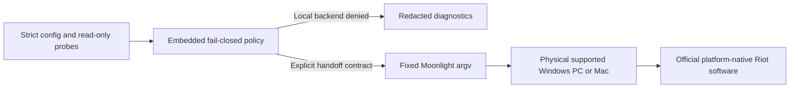

# LeagueBridge

[](LICENSE)


**An open, auditable bridge for League of Legends compatibility diagnostics and
safe access from Linux and BSD—without cheats, client tampering, VM concealment,
or anti-cheat bypasses.**

The product scope is Linux/BSD: Windows and macOS are not LeagueBridge
installation or gameplay targets. Any Windows/macOS references below describe
only an externally managed physical host for the optional Linux/BSD
Moonlight handoff; they do not add Windows/macOS support to this repository.
See [`docs/PLATFORM_SCOPE.md`](docs/PLATFORM_SCOPE.md).

> [!IMPORTANT]
> League of Legends still does **not** run locally on Linux or BSD. Riot states
> that Wine/Lutris cannot satisfy Vanguard's driver requirements, and Riot's VAN
> 138 guidance rejects virtual machines. LeagueBridge cannot change that vendor
> gate with Proton, copied DLLs, Darling, Dockur, QEMU, or bhyve.

LeagueBridge is now a runnable alpha control plane rather than a README-only
research project. It provides fail-closed compatibility policy, read-only host
diagnostics, privacy-safe support bundles, and experimental Moonlight handoffs
to a user-owned **physical** Windows PC or Mac. League and Vanguard stay on
Windows for the Windows route; the macOS route uses Riot's native Mac
client with its Embedded Vanguard architecture and Sunshine's experimental host
support, which has no gamepad hosting.
The Linux/BSD machine is only the viewer/controller in either route.

## Current result

Reviewed **30 August 2026**; Wine, Proton/UMU, VM/Dockur, anti-cheat, and
cloud-provider routes were revalidated against current primary sources:

| Goal | Score/state | Meaning |
| --- | --- | --- |
| LeagueBridge engineering | **74/100 after build-time repository verification** | The verified source tree has repository-backed implementation and control evidence. Ad hoc/dev builds report 0/unverified. CI execution, published-release attestations, native BSD/hardware validation, independent audit, vendor authorization, and native packages remain unverified. |
| Local League on Linux/BSD | **0/100 — blocked** | No Riot-supported client/Vanguard route exists. This is a hard gate, not a weighted score. |
| Physical Windows remote handoff | **0/100 — unvalidated** | All five Linux/BSD client platforms start at zero; no physical-host, native-client, session-quality, or gameplay-interaction gate has current content-addressed runtime evidence. |
| Physical macOS remote handoff | **0/100 — unvalidated** | Sunshine's Mac host is experimental and has no gamepad hosting; all five Linux/BSD clients start at zero and no route-bound runtime gate has authenticated evidence. |

Run `leaguebridge readiness` for the versioned scorecard and its build-time
repository-verification state. An official release build may expose the derived
74 only after verifying every referenced source file; an ad hoc/dev build
reports zero repository-backed points. This marker is not publisher signing.
Documentation or unit tests never inflate the gameplay score.

Commit-bound CI subjects can be checked with the external GitHub attestation
gate documented in [`docs/CI_ATTESTATIONS.md`](docs/CI_ATTESTATIONS.md); a
successful local verification still does not alter the schema-v3 scorecard.

The CI workflow also runs a native Ubuntu Linux amd64 runtime smoke against the
shipped archive's install lifecycle and the CLI's read-only client preflight.
Hosted runners are intentionally headless, so that job records a blocked
Moonlight/client handoff; it does not claim that League, Vanguard, or streamed
gameplay works. Non-PR runs emit score-free, content-addressed native-runtime
subjects for the hosted Linux and explicitly virtualized BSD guest jobs; the
 verifier checks the complete set and every listed file, but these results
 remain non-certifying for League/Vanguard gameplay and physical BSD hardware.
 Windows/macOS appear only as separately owned physical handoff destinations;
 they have no native LeagueBridge release or lifecycle job here.

## What each attempted route actually yields

| Route | LeagueBridge decision | Technical reason |
| --- | --- | --- |
| Wine / WineHQ / Lutris | **Denied** | Riot explicitly says Wine cannot meet Vanguard's driver requirements. |
| Proton, UMU, or custom Proton | **Denied** | Proton and UMU are Wine/Proton-based; Valve does not support kernel-space anti-cheat through Proton, and Riot has not opted into a Linux route. |
| CrossOver | **Denied / limited** | CodeWeavers rates the current Linux entry Limited Functionality and the Mac entry Will Not Install; it remains a Wine-based layer and cannot satisfy Vanguard. |
| Bottles, PlayOnLinux, or another Wine frontend | **Denied** | These tools manage Wine prefixes/runners; they do not add the Windows kernel driver and are covered by the same Riot restriction. |
| Extra/copy-downloaded DLLs | **Rejected** | DLLs cannot create the Windows boot/kernel trust chain and create malware, licensing, and account risk. |
| Copying/repacking Vanguard | **Rejected** | Proprietary redistribution/tampering is unsafe and still does not create an authorized host. |
| `dockur/windows` | **Denied for gameplay** | It packages QEMU/KVM Windows in Docker; the guest is still a VM. |
| WinBoat | **Denied for gameplay** | Its official architecture is a Windows VM inside Docker/Podman with KVM; desktop integration does not make it physical hardware. |
| libvirt/QEMU/KVM/VFIO or desktop hypervisors | **Denied for gameplay** | GPU passthrough, vTPM, and Secure Boot do not turn a VM into Riot-supported physical hardware. |
| FreeBSD bhyve | **Denied for gameplay** | It remains a Windows VM and is covered by the same policy. |
| Waydroid or another Android container/emulator | **Not the PC route** | Android containers do not provide the Windows Riot Client or PC Vanguard driver required by League of Legends for PC. |
| Darling macOS compatibility layer | **Denied / unvalidated** | Darling's upstream GUI work is active development, but its current known-nonfunctional-software documentation says complex GUI applications generally do not work; its open League issue has no implementation. It is not a physical Mac or a Linux-native League/Vanguard route. |
| NVIDIA GeForce NOW or other third-party cloud gaming | **Denied / outside control** | NVIDIA documents a Linux client, but its Vanguard-era announcement says League was removed because GeForce NOW uses unsupported virtual machines; current Linux-client documentation does not reverse that League-specific removal. |
| VM hiding or hardware spoofing | **Permanently out of scope** | This is anti-cheat evasion. |
| Dual-boot physical Windows | **Viable escape hatch** | League works by leaving Linux/BSD; it is not local compatibility. |
| Physical Windows + Sunshine/Moonlight | **Unvalidated handoff candidate** | League remains on a normal Windows PC while Linux/BSD receives video and sends input; end-to-end evidence is still required. |
| Physical macOS + Sunshine/Moonlight | **Experimental, unvalidated handoff candidate** | Riot provides a native Mac client with Embedded Vanguard, but Sunshine's macOS host is experimental, has no gamepad hosting, and lacks physical end-to-end evidence here. |
| Future Riot-supported Linux/BSD path | **Ready to integrate safely** | Requires official support or express written authorization plus current end-to-end evidence. |

The detailed route audit is in
[`docs/research/2026-08-29-route-revalidation.md`](docs/research/2026-08-29-route-revalidation.md);
the earlier platform feasibility record remains available in
[`docs/research/2026-08-26-platform-feasibility.md`](docs/research/2026-08-26-platform-feasibility.md).

## Build and inspect

The shipped LeagueBridge CLI uses the Go standard library plus exactly one
approved external module, the vendored `filippo.io/edwards25519` v1.2.0,
without replacements or additional compiled dependencies. Development tests
also pin one offline Draft 2020-12 JSON-Schema validator (and its transitive
modules) so schema drift fails CI. Go 1.24 or later is required.
CI and release workflows pin Go 1.27.0; the lower version is the source-level
compatibility floor, not the release-builder version.

```sh
go build -mod=vendor -trimpath -o leaguebridge ./cmd/leaguebridge
./leaguebridge status
./leaguebridge doctor
./leaguebridge readiness
./leaguebridge manifest verify
```

### Verify and install a Unix release archive

Linux and BSD release tarballs include deterministic `install.sh` and
`uninstall.sh` lifecycle scripts. Never execute either script before verifying
the downloaded bytes. When a tagged release exists, download the archive and
checksum manifest together, then require provenance from this repository's
release workflow and the exact tag before checking the archive digest:

The example below selects Linux amd64. Substitute one exact suffix from the
release matrix—`linux_amd64`, `freebsd_amd64`, `openbsd_amd64`, `netbsd_amd64`,
or `dragonfly_amd64`—and choose an absolute
prefix appropriate for that machine.

```sh
set -eu
release_tag=v0.1.0
release_version=${release_tag#v}
artifact="leaguebridge_${release_version}_linux_amd64.tar.gz"

gh release download "$release_tag" --repo Yunushan/leaguebridge \
  --pattern "$artifact" --pattern checksums.txt
for subject in checksums.txt "$artifact"; do
  gh attestation verify "$subject" \
    --repo Yunushan/leaguebridge \
    --signer-workflow Yunushan/leaguebridge/.github/workflows/release.yml \
    --source-ref "refs/tags/$release_tag" \
    --deny-self-hosted-runners
done
expected=$(awk -v name="*./$artifact" '$2 == name {print $1}' checksums.txt)
test "$(printf %s "$expected" | wc -c)" -eq 64
case "$(uname -s)" in
  Linux) actual=$(sha256sum "$artifact" | awk '{print $1}') ;;
  FreeBSD|OpenBSD|NetBSD|DragonFly) actual=$(sha256 -q "$artifact") ;;
  *) printf '%s\n' 'unsupported checksum platform' >&2; exit 1 ;;
esac
test "$actual" = "$expected"

mkdir "leaguebridge-${release_version}"
tar -xzf "$artifact" -C "leaguebridge-${release_version}"
cd "leaguebridge-${release_version}"
DESTDIR='' PREFIX=/home/example/.local ./install.sh
/home/example/.local/bin/leaguebridge status
```

The verification syntax follows the
[GitHub CLI attestation contract](https://cli.github.com/manual/gh_attestation_verify).
The installer defaults to `PREFIX=/usr/local` and an empty `DESTDIR`, but setting
both explicitly makes the target auditable. `PREFIX` must be an absolute install
prefix; `DESTDIR` may be explicitly empty for a live install. To upgrade or
repair an installation, run `install.sh` from the newer verified archive with
the same values. The installed uninstaller deliberately has no defaults: it
requires both variables so a helper copied from another prefix cannot silently
delete `/usr/local`. Remove exactly the installed LeagueBridge files with:

```sh
DESTDIR='' PREFIX=/home/example/.local \
  /home/example/.local/libexec/leaguebridge/uninstall.sh
```

Packagers may also set an absolute `DESTDIR`, for example
`DESTDIR=/tmp/package-root PREFIX=/usr/local ./install.sh`. Every nonempty value
must be a normalized absolute path without spaces, dot components, or a
trailing slash. The scripts refuse redirected directory components, refuse to overwrite
final symlinks or special files, install executables as `0755` and documentation
as `0644`, and never recursively delete a prefix. For a privileged install, extract the
archive in a trusted directory and require every existing destination ancestor
to be non-writable by untrusted users: portable POSIX shell checks cannot make
concurrent ancestor replacement race-free.

There is no Windows or macOS LeagueBridge installation procedure. Those
operating systems are external Riot-host platforms only; see
[`docs/PLATFORM_SCOPE.md`](docs/PLATFORM_SCOPE.md).

The CLI runs unprivileged, has no daemon or telemetry, and contains no HTTP
client or upload path for status, readiness, doctor, manifest verification, or
bundle creation. Read-only filesystem probes may still touch user-mounted or
network-backed filesystems, so diagnostic paths must come from trusted local
configuration. Remote Moonlight commands intentionally use the network.

### Commands

```text
status                  Current evidence, scores, and backend matrix
assess                  Fail-closed decision for one local backend
doctor                  Linux/BSD client preflight
bundle                  Preview or write a redacted support bundle
config                  Show, create, locate, or validate credential-free config
manifest                Show/verify embedded authority or validate external data
readiness               Evidence-backed engineering/gameplay/handoff scores
evidence                Create/validate records or verify a bound host/client/session set
remote pair|list|stream Explicit route-bound Moonlight physical-host handoff
version                 Build/version metadata
```

Machine-readable commands accept `--json`. Stable nonzero exits distinguish bad
usage (`2`), a safety/preflight block (`3`), and an internal/execution error (`4`).

### Audit compatibility alternatives

Use the compatibility profile when evaluating a Linux/BSD workstation before
trying a commonly suggested local workaround:

```sh
leaguebridge doctor --profile compatibility --json
```

This profile performs read-only discovery of Wine-compatible frontends
(including CrossOver, Bottles, and PlayOnLinux), Proton and Proton-capable
launchers (including Steam, Heroic, protontricks, and UMU), Lutris,
container/VM launchers (including Dockur-style, libvirt, VirtualBox, VMware,
WinBoat, and bhyve), and other layers such as Darling and Waydroid. A discovered
launcher or known Flatpak app directory is reported as advisory only; the profile
remains blocked because these paths cannot satisfy Riot Vanguard's kernel and
physical-host requirements. The schema-v2 report never starts, installs, patches,
or copies Riot software, DLLs, or drivers.

## Experimental physical-Windows handoff

Use this only with a separate physical Windows gaming PC. Do not point it at
Dockur, a cloud VM, KVM/QEMU, bhyve, Hyper-V, VMware, or VirtualBox.

1. On physical Windows, install League from Riot and verify that a local Practice
   Tool session works.
2. Install [Sunshine](https://github.com/LizardByte/Sunshine) from its official
   project and configure a `League of Legends` application. If you use
   Sunshine's `Desktop` entry instead, pass `--app Desktop` to `config init`.
3. On Linux/BSD, install [Moonlight](https://moonlight-stream.org/) from a trusted
   package source. The supported BSD package names and commands are listed in
   [`docs/REMOTE_PLAY.md`](docs/REMOTE_PLAY.md#linuxbsd-client-prerequisites).
4. On the physical host, complete Riot/Vanguard's own checks and verify
   Sunshine directly. LeagueBridge has no Windows/macOS host package; its
   optional read-only host inspector is documented in
   [`docs/REMOTE_PLAY.md`](docs/REMOTE_PLAY.md).
5. On the Linux/BSD client, run the client preflight, then create a
   credential-free configuration and pair:

```sh
# On the Linux/BSD client
leaguebridge doctor --profile client
leaguebridge config init --host gaming-pc.local --app "League of Legends" --confirm-physical-host
leaguebridge remote pair
leaguebridge remote list
leaguebridge remote stream --acknowledge-unverified-handoff
```

To fail early when the physical host has not published the configured League
entry, require it on the live application-list operation:

```sh
leaguebridge remote list --require-app "League of Legends"
```

This forwards Moonlight's listing normally and checks only for the validated
application name; it does not prove that Riot/Vanguard accepts streamed input.

When the desired application is the one configured for the stream, the safer
configuration-bound form avoids accidentally checking a different name:

```sh
leaguebridge remote list --require-configured-app
```

This checks the exact configured application from the credential-free config;
it never treats an arbitrary listing entry as a substitute for the launch
target.

Every real stream now performs that bounded application-list preflight
automatically. It checks the final application that the stream will launch and
starts no stream when the physical host does not advertise it:

```sh
leaguebridge remote stream --acknowledge-unverified-handoff
```

`--require-app "League of Legends"` or `--require-configured-app` may still be
used to make the expectation explicit, but they do not disable or weaken the
automatic stream guard. This remains only a physical-host handoff; it does not
validate streamed input, latency, or Riot/Vanguard gameplay behavior.

For a real Linux/BSD desktop, the repository also provides a bounded POSIX
client smoke helper. It requires an already-paired, credential-free
configuration and a physical host; it records the Linux/BSD client readiness
and kernel identity, checks the client gates, lists the configured Moonlight
applications, and records only a stream dry-run plan:

```sh
sh scripts/linux-bsd-remote-smoke.sh \
  ./leaguebridge ./remote-evidence "$HOME/.config/leaguebridge/config.json" \
  "League of Legends"
```

The fourth argument is optional. When supplied, the smoke helper requires the
physical host to advertise that exact application as well as the configured
stream application; it must match the configured application. Even without
the fourth argument, the helper always checks the configured application before
recording a passing remote-list check.

The helper does not install Moonlight, pair accounts, start League, or claim
that Riot/Vanguard gameplay works. After it passes, run the stream yourself
and verify a local Practice Tool session on the physical host.

For a stream, optional bounded quality controls can be supplied without
passing arbitrary client flags through the controller:

```sh
leaguebridge remote stream \
  --resolution 1080 --fps 60 --bitrate 20000 --packet-size 1392 --codec h264 \
  --audio-config stereo \
  --preserve-host-settings \
  --acknowledge-unverified-handoff
```

`--resolution` accepts `720`, `1080`, `1440`, `4k`, or a custom `WIDTHxHEIGHT`
pair with width 640–7680 and height 360–4320; `--fps` accepts 10–480;
`--bitrate` accepts 500–500000 Kbps; `--packet-size` accepts 1024–9000 bytes
and must be a multiple of 16; and `--codec` accepts `auto`, `h264`, `hevc`, or
`av1` (`h265` is accepted as an alias for `hevc`). These are invocation-only
settings, translated to the fixed syntax of Moonlight Embedded, Moonlight Qt,
or the official Moonlight Flatpak. `h264` is the broadest decoder compatibility
choice; `auto` keeps the client default. Choose a packet size below the path
MTU; `1392` is a common LAN value and `1024` is a conservative WAN value. They
tune the stream only; they do not prove display, decoder, input, latency, or
League gameplay compatibility. `--audio-config` accepts `stereo`,
`5.1-surround`, or `7.1-surround`; stereo is Embedded's default, while the
surround choices select its documented `-surround 5.1` or `-surround 7.1`
forms. Qt and Flatpak receive Qt's matching `-audio-config` value. Audio
channel selection is a stream hint and still depends on the Linux/BSD audio
backend and physical host configuration. `--preserve-host-settings` asks the
selected client not to apply its game/settings optimization path; it maps to
Embedded's `-nosops` and Qt/Flatpak's `-no-game-optimization`. This helps keep
the physical host's League display settings stable, but remains a client hint.
`--network-mode` accepts `auto`, `lan`, or `wan` and is available only with
Moonlight Embedded. It maps to Embedded's documented `-remote auto`, `-remote
no`, or `-remote yes` values. Use `lan` for a local network and `wan` when the
host is reached across a routed/WAN path; it is a transport hint, not proof of
latency, packet delivery, or gameplay.
`--decoder` accepts `auto`, `software`, or
`hardware` and is available only with Moonlight Qt/Flatpak; it is useful when a
Linux/BSD graphics stack needs an explicit decoder choice. `--display-mode`
accepts `fullscreen`, `windowed`, or `borderless`. Qt/Flatpak support all three;
Embedded supports `windowed` and uses fullscreen by default, but does not
support `borderless`. The setting controls the local Moonlight window, not the
physical host's League window.

Moonlight Embedded also accepts the bounded `--platform` control with `auto`,
`x11`, `x11_vdpau`, or `sdl`. It maps to Embedded's documented `-platform`
option, which selects the local audio, video, and input backend. `auto` keeps
the package default; `sdl` can be useful on a BSD desktop whose packaged
Embedded build provides SDL rather than the X11 backend. This is a backend
selection hint, not proof that the selected backend is compiled in or that
input, audio, or League gameplay works.

The example above uses only options shared by Qt and Embedded, so it is valid
for every supported Linux/BSD client flavor. With Moonlight Qt or Flatpak, add
`--client moonlight-embedded` (or the `moonlight` alias on BSD) before using
`--platform`; select `--client moonlight-qt` or `--client flatpak` before using
the Qt-only `--decoder`, `--display-mode borderless`, or mouse-mode controls.

Moonlight Embedded receives `-packetsize`, `-codec`, `-surround`, `-nosops`,
`-remote`, and `-windowed`; Qt and Flatpak receive Qt's `-packet-size`, `-video-codec`,
`-audio-config`, `-no-game-optimization`, `-video-decoder`, and `-display-mode`
spellings. Custom resolutions become Qt's `-resolution WIDTHxHEIGHT` and
Embedded's paired `-width WIDTH -height HEIGHT` options. Embedded receives
`-platform` when `--platform` is not `auto`. Qt
and Flatpak reject `--platform` because their documented CLI has no equivalent
backend selector. Qt codec values are `H.264`/`HEVC`/`AV1`, while decoder values are
`auto`, `software`, or `hardware`. This translation is
based on the [current Moonlight Qt stream parser](https://raw.githubusercontent.com/moonlight-stream/moonlight-qt/master/app/cli/commandlineparser.cpp)
and [Moonlight Embedded command reference](https://github.com/moonlight-stream/moonlight-embedded/blob/master/docs/README.pod).

Qt and Flatpak clients also accept the bounded `--absolute-mouse` or
`--no-absolute-mouse` controls; Embedded clients reject these Qt-only options.
They select Moonlight's documented mouse mode but do not fix Riot/Vanguard
compatibility.

`remote pair` and `remote list` are control-plane operations and only require an
eligible Linux/BSD client plus a launchable Moonlight client. A
`remote stream --dry-run` uses the same control-plane prerequisites and can
inspect its fixed argv from a headless SSH session because it never contacts
the host or starts Moonlight. A live `remote stream` additionally requires a
reachable X11/Wayland endpoint or an explicitly selected direct SDL/Qt display
backend with its device node, plus a display-backed input-path indicator; the
latter does not prove keyboard/mouse delivery. A headless live stream is
intentionally blocked. Pairing and app listing have a 60-second execution
deadline so an unreachable host cannot hang the terminal; interactive
streaming has no controller-imposed deadline and ends when Moonlight exits or
the caller cancels it.

For direct SDL KMS/DRM on BSD, current SDL documentation describes KMSDRM as
supported on FreeBSD and OpenBSD, usable on DragonFly BSD only with the needed
privileges, and unsupported on NetBSD; LeagueBridge therefore fails closed for
NetBSD's `SDL_VIDEODRIVER=kmsdrm` combination. OpenBSD's direct video endpoint
is normally `/dev/drm*`, while other supported KMSDRM targets commonly expose
`/dev/dri/card*`. On OpenBSD, SDL's WSCONS input path uses `/dev/wskbd*` and
`/dev/wsmouse`; those devices are accepted for direct SDL preflight when the
session can access them. FreeBSD and DragonFly use their SDL evdev input path,
so the preflight looks for `/dev/input/event*` there. Use X11 or Wayland on
NetBSD.
See [SDL's KMSDRM/*BSD notes](https://github.com/libsdl-org/SDL/blob/main/docs/README-kmsbsd.md).

In this alpha, the Windows-host doctor is deliberately advisory and returns the
blocked exit code (`3`) while any physicality, hardware, TPM/IOMMU, or active
Vanguard prerequisite remains unverified. It cannot certify a host. Treat its
output as a checklist, satisfy Riot/Vanguard's own per-machine pre-check, and
prove the game locally in Practice Tool before configuring the handoff.

Use `--dry-run` to inspect the exact executable and argument vector without
starting Moonlight. LeagueBridge never invokes a shell and never handles Riot or
Moonlight credentials.

### Record real validation evidence

The repository examples are intentionally unverified and cannot raise a score.
Create fresh records for the machines actually tested, replace a check only
after observing it, and keep credentials and machine/account identifiers out of
the JSON and referenced artifacts:

```sh
leaguebridge evidence template-set --directory ./evidence-set --client-platform linux
HOST=./evidence-set/host.json
CLIENT=./evidence-set/client.json
SESSION=./evidence-set/session.json

leaguebridge evidence validate --file "$HOST" --artifacts host-artifacts
leaguebridge evidence validate --file "$CLIENT" --artifacts client-artifacts
leaguebridge evidence verify-set --host "$HOST" --client "$CLIENT" --session "$SESSION" \
  --host-artifacts host-artifacts --client-artifacts client-artifacts \
  --session-artifacts session-artifacts
```

`evidence template-set` generates the host, client, and session templates with
one shared `validation_run_id`, writes them with mode `0600` where supported,
refuses to overwrite any existing member, and removes staged files if the set
cannot be published completely. Use the individual `evidence template`
command when a record must be regenerated separately.

`evidence validate` prints the SHA-256 of the exact bytes it read. Put the host
and client digests into the session record only after those files are final;
editing either file invalidates the binding. Without artifact directories, a
passing claim can reach only `claims-complete`; with exact regular-file bundles
whose sizes and SHA-256 digests match, it can reach `complete` and reports
`artifacts_verified=true`. Only `evidence verify-set` checks the referenced
record bytes and cross-record run, timing, expiry, and client-subject invariants
together. Self-attested, stale, partially passing, unreviewed, mismatched, or
zero-latency-placeholder records return the blocked exit code (`3`). Even
artifact-verified lab-observed or independent-review sets are manual evidence:
schema v1 has no trusted reviewer identity or signature, so all such records
remain ineligible for automatic score promotion. Records never enable a blocked
backend or authorize gameplay. See the full
[validation-evidence contract](docs/VALIDATION_EVIDENCE.md).

An explicit `evidence v2 verify` path now authenticates one exact,
artifact-verified Windows- or macOS-route record set with scoped Ed25519
reviewer keys. The host platform and architecture are bound to the selected
route, and Windows evidence cannot be reused for macOS. The command accepts no
key or trust-policy flag. This release intentionally provisions no production
reviewer keys, so the command remains blocked and readiness schema v3 stays at
zero for every remote cell. Readiness promotion, genuine reviewer keys, and
physical-run signatures are later reviewed steps; v2 does not authorize Riot
software or local Linux/BSD play.
The signed v2 layers require canonical whole-second UTC timestamps, while the
exactly hash-bound v1 records retain valid RFC 3339 offset and fractional-second
representations. A future successful verification reports authentication and
artifact verification but remains explicitly separate from the v3 scorecard.
When the application-owned reviewer policy is provisioned,
`evidence v2 promote` runs the same verification and emits the derived
schema-v4 result for that one route/client cell. The current policy rejects
the operation before derivation; the v4 result is not an overall engineering
score, local Linux/BSD launch authorization, or Riot authorization.

Before reviewers sign a set, `evidence v2 prepare` verifies the exact three
records and all three artifact directories, then emits the score-free v2
payload bytes with their SHA-256 and canonical base64url representation. Use
`--output` to create a new, mode-restricted payload file; the command never
overwrites an existing file, signs data, accepts reviewer keys, or promotes
readiness. Sign the exact emitted bytes through the separately governed
reviewer process and retain the payload unchanged for later envelope
verification.

Client discovery is passive and never executes a candidate binary. `auto`
prefers a `moonlight-qt` executable; a generic `moonlight` name follows package
conventions (Embedded on FreeBSD and DragonFly BSD, Qt elsewhere). Users of
Moonlight Embedded can select the explicit `--client moonlight-embedded` alias
(or the backwards-compatible `--client moonlight`); the resolver accepts either
the `moonlight-embedded` executable name or the generic `moonlight` name.
Downstream Qt packages installed as `moonlight` can be selected with
`--client moonlight-qt`. A
Flatpak-only installation can be selected explicitly with `--client flatpak`;
LeagueBridge then invokes only the fixed `flatpak run
com.moonlight_stream.Moonlight` argument vector.
Non-dry-run execution also requires the real host resolver to bind the selected
launcher to an absolute regular file and snapshot its identity; passive fixture
or custom environments remain limited to planning and dry-run inspection.

Remote input/streaming is not a Riot Linux/BSD support contract. Stop immediately
if Vanguard reports an error; do not hide software, patch input, or attempt a
workaround. See [`docs/REMOTE_PLAY.md`](docs/REMOTE_PLAY.md) for the threat model
and validation sequence.

## Architecture and safety invariants



- The reviewed manifest embedded in the binary is authoritative.
- External manifests are informational/deny-only and cannot enable execution.
- Unknown, malformed, missing, future-dated, stale, or unbound evidence fails closed.
- No `--force` flag can promote Wine, Proton, a VM, or another denied backend.
- Remote execution uses an argument array, never a shell.
- Diagnostics collect an allowlist, redact defensively, and never upload.
- Riot credentials remain entirely inside official Riot software.
- LeagueBridge ships no Riot binary, asset, driver, DLL, installer, or Windows
  image.
- No operation requires root or Administrator.

Read the full [architecture](docs/ARCHITECTURE.md),
[threat model](docs/THREAT_MODEL.md), [privacy policy](docs/PRIVACY.md), and
[support policy](docs/SUPPORT_POLICY.md).

## Platform targets

The release contract contains exactly five CLI targets: amd64 Linux, FreeBSD,
OpenBSD, NetBSD, and DragonFly BSD. A cross-build proves compilation, not
League support. Windows and macOS are external Riot-host platforms only and
are not LeagueBridge release or installation targets.

| Role | Current state |
| --- | --- |
| Linux amd64 Moonlight client | Hosted runtime/install smoke plus build/test target; physical desktop evidence pending |
| FreeBSD amd64 Moonlight client | Cross-build plus QEMU runtime job configured; successful native evidence pending |
| OpenBSD amd64 Moonlight client | Cross-build plus QEMU runtime job configured; successful native evidence pending |
| NetBSD amd64 Moonlight client | Cross-build plus QEMU runtime job configured; successful native evidence pending |
| DragonFly BSD amd64 Moonlight client | Cross-build plus QEMU runtime job configured; successful native evidence pending |
| External physical Windows/macOS streaming host | Optional handoff destination; LeagueBridge does not install or validate the host's Riot software |
| Local Linux/BSD League runtime | Blocked on Riot support/authorization |

## Diagnostics and privacy

Preview exactly what a support bundle would contain:

```sh
leaguebridge bundle --preview
leaguebridge bundle --output leaguebridge-support.zip
```

Bundles contain only generated `report.json` and a README. They exclude raw logs,
configuration, hostnames, usernames, home paths, network addresses, credentials,
cookies, and tokens. Creation is bounded, atomic, and refuses overwrite. Unix
builds request mode `0600`. Exclusive publication requires same-directory
hard-link support; for FAT/exFAT or an incompatible network/cloud filesystem,
write the bundle to a local UFS/ext filesystem and copy it only after
inspection. LeagueBridge never uploads the bundle.

## Development and releases

```sh
go test -mod=vendor -race ./...
go vet -mod=vendor ./...
go run -mod=vendor ./tools/coverage -minimum 80
go run golang.org/x/vuln/cmd/govulncheck@v1.7.0 ./...
```

CI tests the Linux source surface, scans for reachable known Go vulnerabilities,
enforces core coverage, cross-builds the exact five-target Linux/BSD release
matrix, and runs a hosted Linux amd64 runtime/install smoke plus QEMU-backed
runtime jobs for the four BSD kernels. Successful non-PR runtime jobs emit
score-free native-runtime subjects and a downstream job verifies their exact
commit/tree/run identity and file digests; they still do not count as readiness
evidence until an externally authenticated run is retained.
Release builds repeat the vulnerability gate,
run twice to catch same-input/same-environment reproducibility regressions, and
smoke the shared Unix install/upgrade/uninstall lifecycle on Linux after each
build. Tagged
releases normalize locale, modes, ownership metadata, and timestamps, then
produce five Linux/BSD tar archives, component-derived SPDX SBOMs, SHA-256 checksums,
and GitHub/Sigstore provenance attestations. Cross-environment reproducibility
is not yet independently proven. The artifact-construction script fetches no
modules and resolves every module input from the committed vendor tree. Direct
project checks in the artifact-producing job also use vendored mode; tests may
run isolated adversarial fixture commands that cannot supply release artifacts.
A separate prerequisite job resolves the pinned vulnerability
scanner and its vulnerability database, produces no artifacts, and must pass
before construction starts. The shipped executable
contains exactly one approved external module, `filippo.io/edwards25519`
v1.2.0, with no replacement or additional compiled dependency; its exact
identity is bound into the v4 release build contract and reported in the SBOM.
The upstream BSD-3-Clause notice is carried in [`LICENSE`](LICENSE).
Publication fails closed unless GitHub reports
the triggering `v*` tag as protected; maintainers must configure an immutable
release-tag ruleset before the first release. Successful hosted CI, native OS
packages, and real physical-host validation are still required before the
engineering score can reach 100.

## Contributing and security

Contributions are welcome for diagnostics, native OS fixtures, packaging,
Moonlight availability, manual evidence, accessibility, and upstream liaison.
Gameplay automation, public-queue bots, VM concealment, anti-cheat bypasses,
injection, copied DLLs, proprietary redistribution, and security-disablement will
not be accepted.

The draft request for a Riot-authorized Linux/BSD runtime is in
[`docs/UPSTREAM_LINUX_BSD_REQUEST.md`](docs/UPSTREAM_LINUX_BSD_REQUEST.md).

See [`CONTRIBUTING.md`](CONTRIBUTING.md), [`GOVERNANCE.md`](GOVERNANCE.md), and
[`SECURITY.md`](SECURITY.md). Riot vulnerabilities belong in
[Riot's reporting process](https://www.riotgames.com/en/reporting-a-security-vulnerability),
not this repository.

## Authoritative references

- [Riot: League minimum and recommended requirements](https://support.riotgames.com/en-us/league-of-legends/performance/minimum-and-recommended-system-requirements-league-of-legends)
- [Riot: Vanguard x LoL (Wine/Linux/VM explanation)](https://www.leagueoflegends.com/en-us/news/dev/dev-vanguard-x-lol/)
- [Riot: Vanguard error codes, including VAN 138 for VMs](https://support.riotgames.com/en-us/riot/performance/vanguard-error-codes)
- [Riot: Vanguard On-Demand](https://www.riotgames.com/en/news/vanguard-on-demand)
- [Valve: Proton anti-cheat guidance](https://partner.steamgames.com/doc/steamhardware/proton)
- [Dockur: Windows project](https://github.com/dockur/windows)
- [Microsoft: memory integrity in virtual machines](https://learn.microsoft.com/en-us/windows/security/hardware-security/enable-virtualization-based-protection-of-code-integrity)

## Legal notice

LeagueBridge is not endorsed by Riot Games and does not represent the views of
Riot Games or anyone involved in producing or managing Riot Games properties.
League of Legends, Riot Games, Riot Client, Riot Vanguard, and related names and
assets are property of their respective owners.

The maintainers currently operate this independent project noncommercially; the
0BSD license itself permits commercial reuse. A player-facing product must
complete any Riot registration/review then required, and registration alone does
not authorize a compatibility or anti-cheat runtime.

LeagueBridge's project-authored source is released under the Zero-Clause BSD
License. The combined [license and third-party notice](LICENSE) also carries
the BSD-3-Clause terms required by the compiled Ed25519 dependency.
